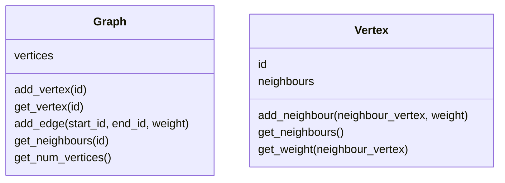
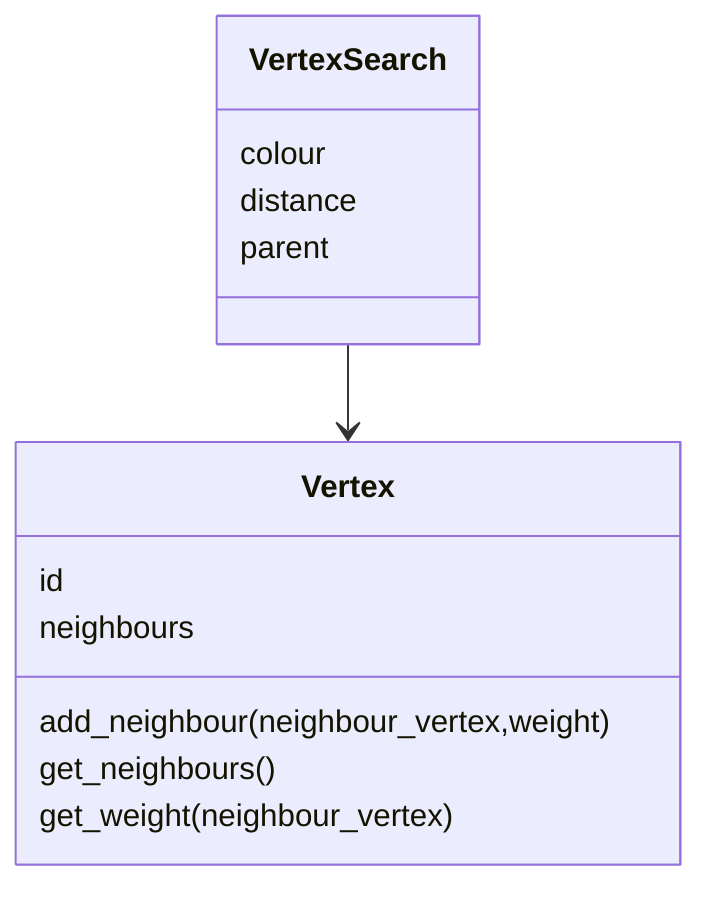

import CollapsibleAnswer from '@site/src/components/CollapsibleAnswer';
import DeepDive from '@site/src/components/DeepDive';
import ImageCard from '@site/src/components/ImageCard';
import ChatBaseBubble from "@site/src/components/ChatBaseBubble";
import CenterItem from "@site/src/components/CenterItem";

# Breadth First Search

Breadth-first search is a graph traversal algorithm that explores all the vertices of a graph at the same level before moving to the next level, ensuring the shortest path to each vertex is discovered first.

<ChatBaseBubble/>

### Goals

By the end of this lesson, you should be able to:
- explain and implement **breadth** first search

:::keyword Keywords
`graph traversal`, `breadth first search`, `distance`, `colour`, `parent vertex`
:::

## Introduction

In the previous lesson, we have introduced how we can represent a graph using object oriented programming. We created two classes `Vertex` and `Graph`. One main use cases with this kind of data is to do some search. For example, given the graph of MRT lines, we would like to search what is the path to take from one station to another station. We usually are interested in the shortest path. This is what Google Map and other Map application does. In this lesson, we will discuss two graph search algorithms: breadth-first search and depth-first search.

To do these algorithms, our `Vertex` class and `Graph` class may need some additional attributes to store more information as it performs the search. One way to modify our classes is to create a new class. However, we would like to introduce the concept of **Inheritance**. Inheritance allows us to _re-use_ our existing class and create a new class that is derived from our existing class. Therefore, to implement our search algorithm, we will use inheritance to modify our existing `Vertex` and `Graph` classes.

## Breadth First Search

Breadth first search is normally used to find a shortest path between two vertices. For example, when you plan your travel from one point to another point, breadth first search can identify the path you should take that gives the shortest path. How does this work? Let's take a look at the graph below.

### (C)ases

<ImageCard path={require("./images/bfs_graph_example.jpg").default} widthPercentage="30%"/>

Let's say we want to find the shortest path from A to F. The way breadth-first search does is to calculate the distance of every vertex from A. So in this case, B will have a distance of 1 since it takes only one step from A to B. On the other hand, C has a distance of 2. D, however, has a distance of 1 since there is an edge from A to D connecting the two vertices directly. Vertex E has a distance 2 because from A it can go to D and then to E in two steps. Finally, F has a distance of 3. There are actually two paths from A to F. The first one is A - B - C - F and the second one is A - D - E - F. Notice that both has the same distance, which is 3.

How can we obtain all the distances for each vertex? We will start with the starting vertex which in this case is A. Next, we can look into the neighbouring vertices that A has. So in this case, A has two neighbours, i.e. B and D. We can then explore each of the neighbours. We can draw the the vertex that we are exploring as a kind of a tree.
<ImageCard path={require("./images/bfs_tree1.jpg").default} widthPercentage="30%"/>

We can then take turn to explore the neighbours of each of the children in the tree. In this case, B has two neighbours, i.e. A and C. But since we have visited A, we do not want to visit A again. So we should only visit C. This indicates that we need to mark the vertices that we have visited. Similarly, D has three children, i.e. A, C and E. But both A and C has been visited, so we should just add E into our tree. We can continue the same steps until all vertices have been visited. The final tree looks like the following.
<ImageCard path={require("./images/bfs_tree2.jpg").default} widthPercentage="30%"/>

Notice that we can actually add F either to C or to E in the tree above. In this case, we choose to add to C. The question is when do we stop? We should stop when all the vertices have been explored in terms of their children. Therefore, we need some way to indicate if a Vertex's children have been fully explored. The way we are going to do this is to colour the vertices. Moreover, we are going to use three different colours:

- white: is used to indicate that we have not visited the vertex
- grey: is used to indicate that we have visited the vertex but we have not completely explored all the neighbours
- black: is when we have explored all the neighbours of this vertex.

With this in mind, the image below shows the progression of the vertex exploration and how the colour of each vertex changes.
<ImageCard path={require("./images/bfs_colour.jpg").default} widthPercentage="40%"/>

In the figures above, we use a Queue data structure to explore the vertices. When we visit vertex, we put all its neighbouring vertices into a queue. This also ensures that we explore the vertices in a **breadth-first** manner. For example, when we explore B from A, we did not go to C but rather D, which is at the same level as B in our search tree. This is where the name breadth-first search comes from. So now we are ready to write our algorithm for breadth-first search.

### (D)esign of Algorithm

<DeepDive title="Show Pseudocode">

```
Input:
- G: Graph
- s: starting vertex
Output:
- Graph with distances on every vertex from s
Steps:
1. Initialize every vertex with the following:
  1.1 set color to white
  1.2 set distance to INF
2. start from s vertex:
  2.1 set s' color to grey
  2.2 set s' distance to 0
3. put s into the Queue
4. As long as Queue is not empty
  4.1 take out one vertex from Queue and store to u
  4.2 for each neighbour of vertex u, do:
    4.2.1 if the neighbour colour is white, do:
      4.2.1.1 set the neighbour's colour to grey
      4.2.1.2 set the neighbour's distance to u's distance + 1
      4.2.1.3 put the neighbour into the Queue
  4.3 after finish exploring all neighbours, set u's color to black
```

</DeepDive>

In the above algorithm, we start by setting all the vertices to white and have a distance of `INF` (infinite) or any large number value greater than the number of the vertices. We then start from the vertex s and explore its neighbours. Everytime we explore a neighbour, we check its colour. If the colour is white, it means that it has not been visited previously, so we change the colour to grey and add the distance by one. We then put this neighbour into the queue to visit its neighbours later on. We proceed visiting the vertices by taking out the vertex from the Queue. As mentioned, it is the Queue that ensures that we visit the vertices in a breadth-first manner.

The only thing about this algorithm is that we only get a graph with distances on each vertex, but we would not be able to retrieve the path to take from s to the destination vertex. In order to find the shortest path, we need to store the **parent** vertex when we visit a neighbouring vertex. To do this, we modify the algorithm as follows.

<DeepDive title="Show Pseudocode">

```
Input:
- G: Graph
- s: starting vertex
Output:
- Graph with:
  - distances on every vertex from s
  - parent vertex on every vertex that leads back to s
Steps:
1. Initialize every vertex with the following:
  1.1 set color to white
  1.2 set distance to INF
  1.3 set parent to NILL
2. start from s vertex:
  2.1 set s' color to grey
  2.2 set s' distance to 0
  2.3 set s' parent to NILL
3. put s into the Queue
4. As long as Queue is not empty
  4.1 take out one vertex from Queue and store to u
  4.2 for each neighbour of vertex u, do:
    4.2.1 if the neighbour colour is white, do:
      4.2.1.1 set the neighbour's colour to grey
      4.2.1.2 set the neighbour's distance to u's distance + 1
      4.2.1.3 set u as the parent vertex of the neighbour
      4.2.1.4 put the neighbour into the Queue
  4.3 after finish exploring all neighbours, set u's color to black
```

</DeepDive>

In the second algorithm, we have a new attribute called **parent**. In the beginning we set all vertices to have NILL as their parents. Since s is the starting vertex, it has no parent and so we set to NILL in step 2.3. We added step 4.2.1.3 where we set u as the parent to the neighbouring vertex when we add that neighbouring vertex into the Queue.

With this, we can write another algorithm to retrieve the path from s to some destination vertex v.

<DeepDive title="Show Pseudocode">

```
Find-Path BFS
Input:
- G: graph after running BFS
- s: start vertex
- v: end vertex
Output:
- list of vertices that gives the shortest path from s to v
Steps:
1. if v is the same as the start vertex
  1.1 return a list with one element, i.e. s
2. otherwise, check if parent of v is NILL
  2.1 return "No path from s to v exist"
3. otherwise,
  3.1 call find-path(G, s, parent of v)
  3.2 add v into the result from 3.1
```

The above algorithm uses recursion. There are two base cases. The first base case is when the destination vertex to be the same as the starting vertex. In this case, the output is just that vertex. The second base case is when there is no path from s to v. We know there is no path when along the path starting from v we find a vertex which parent is NILL. The recursion case is described in step 3. In this case, we call the same function but with the destination vertex to be the parent of the current destination vertex. By moving the destination vertex to the parent, we reduce the problem and make it smaller until we reach base case described in step 1.

Let's see an example when we search a shortest path from A to F in the previous graph. In this case, v is not the same as s since A and F are two different vertices. So we look into F's parent, which is C. Now we call the same function to find the path from A to C. Since A and C are different, we look into C's parent, which is B and call the function to find the path from A to B. Finally, we look into B's parent and find the path from A to A. This is the base case. When we reach the base case, we return a list containing A as the result (step 1.1). Then we move back and do step 3.2 to add B, C, and finally F. So the shortest path from A to F will be a list `[A, B, C, F]`.

Now it's time to implement the algorithm. But before we can implement the algorithm, we need to modify the class `Vertex` to contain a few additional attributes:

- colour
- distance
- parent

As mentioned in the Introduction, we will do this using the concept of **Inheritance**.

</DeepDive>

## Inheritance

Inheritance is an important concept in object oriented programming that allows us to re-use existing code or classes we have written. In our example here, we already have a class `Vertex` and `Graph`. However, the class `Vertex` only contains `id` and `neighbours`.



<br/>

As shown in the previous section, our `Vertex` object has additional attributes such as _colour_, _distance_, and _parent_. We can actually create a new class containing all these new properties as well as the commonly found properties of a vertex (`id` and `neighbours`). However, we will duplicate our codes and rewriting the methods that is the same for all `Vertex` objects such as adding a neighbour. Inheritance allows us to create a new class without duplicating all the other parts that is the same. By using inheritance, we create a new class by _deriving_ it from an existing base class. In this example, we can create a new class called `VertexSearch` that is derived from a base class `Vertex`. When a class inherits another class, the new class possess all the attributes and methods of its parent class. This means that `VertexSearch` class contains both `id` and `neighbours` as well as all the methods that `Vertex` class has. What we need to do is simply to specify what is different with `VertexSearch` that `Vertex` class does not have. We can represent this relationship using a UML diagram as shown below.



<br/>

In the UML diagram, the relationship is represented as an arrow with a white triangle pointing from the child class to the parent class. This relationship is also called **is-a** relationship which simply means that `VertexSearch` _is-a_ `Vertex`, it has all the attributes and methods of a `Vertex` object.

In Python, we can specify if a class derives from another class using the following syntax:

```python
class NameSubClass(NameBaseClass):
    pass
```

For our example here, we can write the `VertexSearch` class as follows.

```python
class VertexSearch(Vertex):
    pass
```

In the above class definition, we have `Vertex` inside the parenthesis to indicate to Python that we will use this as the _parent_ class or _base_ of `VertexSearch` class. In this new class, we can initialize all the new attributes as usual:

```python
import sys

class VertexSearch(Vertex):
    def __init__(self, id=""):
        super().__init__(id)
        self.colour = "white"
        self.d = sys.maxsize
        self.parent = None
```

Notice here that we initialize:

- `colour` to be "white"
- `d` to be a large integer number
- `parent` to be a `None` object

The first line `super().__init__(id)` is to call the parent class' initialization method to initialize the both the `id` and the `neighbours`. The word `super` comes from Latin which means "above". Therefore, `super()` method returns a reference to the parent's class. Since we have both `__init__()` method in `VertexSearch` and `Vertex`, we need to be able to differentiate the two methods. For this purpose, Python provides `super()` method to refer to the parent's class methods instead of the current class.

In the child class `VertexSearch` we redefine the `__init__()` method of the parent's class. This is what is called as **method overriding**. We will discuss more of Inheritance in future lessons.
