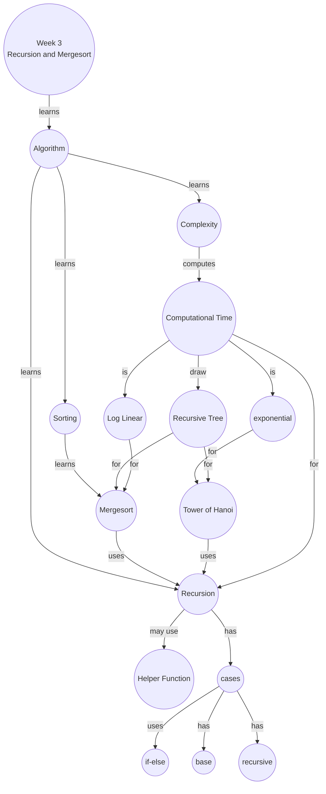

import CollapsibleAnswer from '@site/src/components/CollapsibleAnswer';
import DeepDive from '@site/src/components/DeepDive';
import ImageCard from '@site/src/components/ImageCard';
import ChatBaseBubble from "@site/src/components/ChatBaseBubble";

# Week 3: Divide and Conquer

<ChatBaseBubble/>

### Concept Map

See below if you need to zoom in.

<iframe src="https://sutdapac-my.sharepoint.com/personal/oka_kurniawan_sutd_edu_sg/_layouts/15/embed.aspx?UniqueId=ea2493e1-e9ca-4f2e-892b-fe82e7b2dec4" width="640" height="360" frameborder="0" scrolling="no" allowfullscreen title="DDW Concept Map-Week 3.drawio.png"></iframe>

