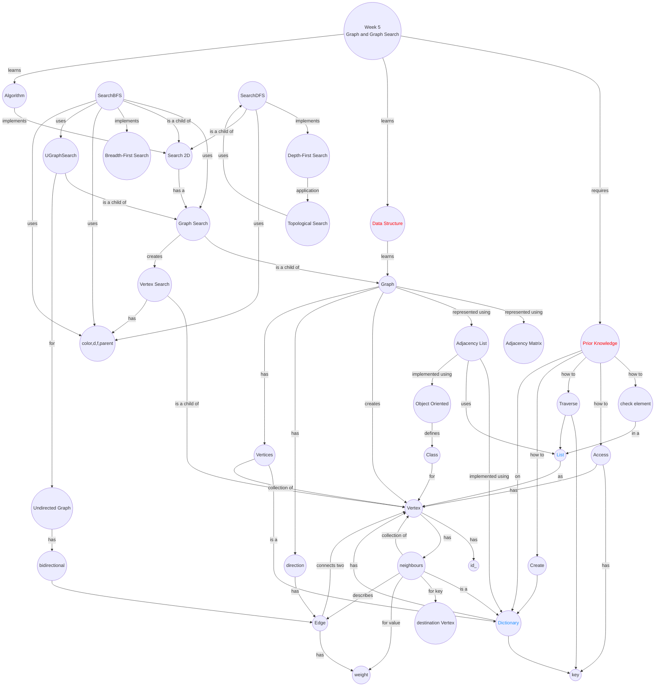

import CollapsibleAnswer from '@site/src/components/CollapsibleAnswer';
import DeepDive from '@site/src/components/DeepDive';
import ImageCard from '@site/src/components/ImageCard';
import ChatBaseBubble from "@site/src/components/ChatBaseBubble";

# Week 5: Searching Data

<ChatBaseBubble/>

### Concept Map

<!-- <ImageCard path={"https://drive.google.com/uc?export=view&id=1B91OlTA0Ss2HLDxf_PJcS9O4GZPDRI9K"} widthPercentage="100%"/> -->
