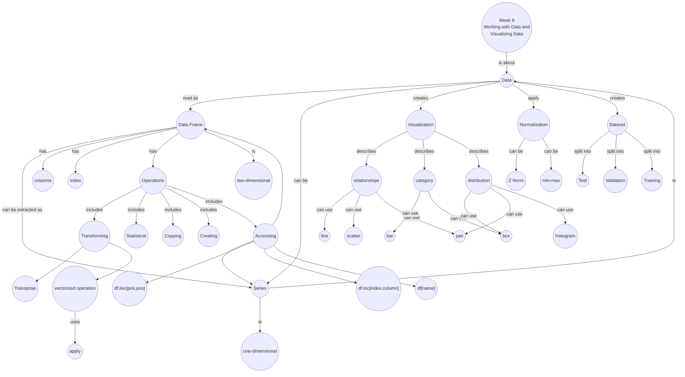

import CollapsibleAnswer from '@site/src/components/CollapsibleAnswer';
import DeepDive from '@site/src/components/DeepDive';
import ImageCard from '@site/src/components/ImageCard';
import ChatBaseBubble from "@site/src/components/ChatBaseBubble";

# Week 8: Visualizing and Processing Data

<ChatBaseBubble/>

### Concept Map

See below if you need to zoom in.

<iframe src="https://sutdapac-my.sharepoint.com/personal/oka_kurniawan_sutd_edu_sg/_layouts/15/embed.aspx?UniqueId=59eba8ec-acb5-4e47-9910-3d3a4a44dede" width="640" height="360" frameborder="0" scrolling="no" allowfullscreen title="DDW Concept Map-Week 8.drawio.png"></iframe>