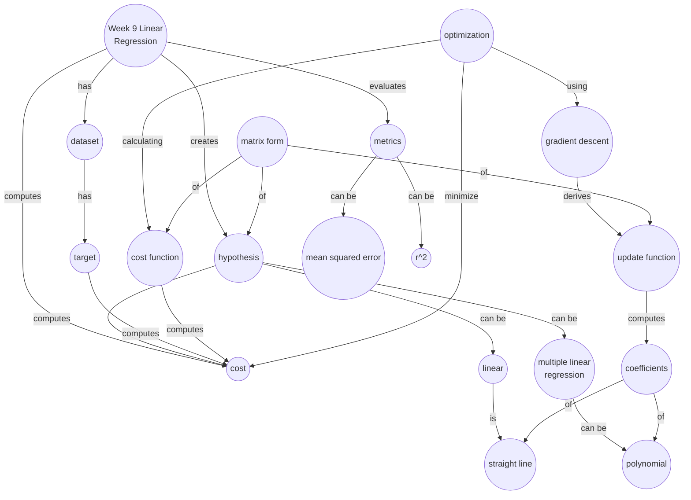

import CollapsibleAnswer from '@site/src/components/CollapsibleAnswer';
import DeepDive from '@site/src/components/DeepDive';
import ImageCard from '@site/src/components/ImageCard';
import ChatBaseBubble from "@site/src/components/ChatBaseBubble";

# Week 9: Modelling Continuous Data

<ChatBaseBubble/>

### Concept Map

<!-- <ImageCard path={"https://drive.google.com/uc?export=view&id=15EkM4XMdMyYjLkg_yFgeKlsgpl-qYjUU"} widthPercentage="100%"/> -->
