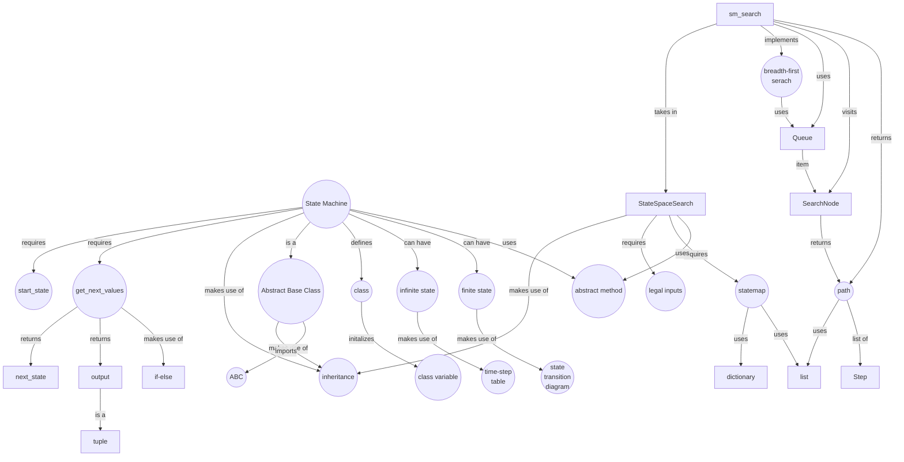

import CollapsibleAnswer from '@site/src/components/CollapsibleAnswer';
import DeepDive from '@site/src/components/DeepDive';
import ImageCard from '@site/src/components/ImageCard';
import ChatBaseBubble from "@site/src/components/ChatBaseBubble";

# Week 12: Design of State Machines

<ChatBaseBubble/>

### Concept Map

See below if you need to zoom in.

<iframe src="https://sutdapac-my.sharepoint.com/personal/oka_kurniawan_sutd_edu_sg/_layouts/15/embed.aspx?UniqueId=dbc9dbbb-2e20-4ba7-b418-f954263e5b98" width="640" height="360" frameborder="0" scrolling="no" allowfullscreen title="DDW Concept Map-Week 12.drawio.png"></iframe>

